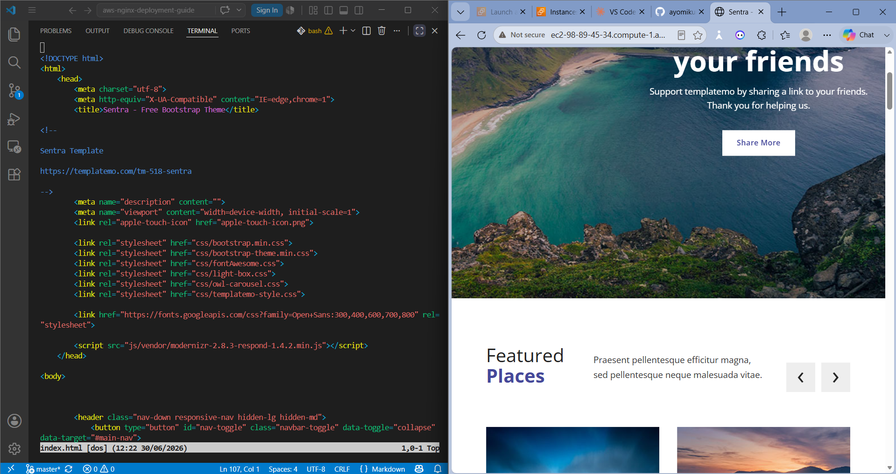

# Deployment of an HTML Website on an AWS EC2 Server Using NGINX

## Overview

This project demonstrates how to deploy a static HTML website on an Amazon EC2 instance using the NGINX web server. The website is hosted on a Linux server, making it accessible over the internet through the instance's public IP address or public DNS.

The objective of this project is to gain hands-on experience with Linux server administration, AWS EC2 provisioning, and web server configuration using NGINX.

---

## Technologies Used

- AWS EC2
- Linux
- NGINX Web Server
- SSH

---

## Prerequisites

Before getting started, ensure you have:

- An AWS account
- An EC2 instance running Linux (Ubuntu)
- An SSH key pair (`.pem` file)
- Basic knowledge of Linux command-line operations
- A static HTML website

---

## Deployment Steps

### 1. Launch an EC2 Instance

Create a Linux EC2 instance on AWS and ensure that:

- Port **22 (SSH)** is open.
- Port **80 (HTTP)** is allowed in the Security Group.

---

### 2. Connect to the EC2 Instance

SSH into the instance from your local machine.

```bash
ssh -i /path/to/your-key.pem ubuntu@<EC2-Public-IP>
```

---

### 3. Install NGINX

Update the package list and install NGINX.

```bash
sudo apt update
sudo apt install nginx -y
```

---

### 4. Verify the NGINX Service

Confirm that the NGINX service is running.

```bash
sudo systemctl status nginx
```

If the service is active, NGINX has been installed successfully.

---

### 5. Deploy the Website Files

Copy your website files (such as `index.html`, CSS, JavaScript, and images) into the NGINX default web directory.

```bash
sudo cp -r * /var/www/html/
```

---

### 6. Access the Website

Open your browser and visit:

```
http://<EC2-Public-IP>
```

or

```
http://<EC2-Public-DNS>
```

Your HTML website should now be successfully hosted and accessible online.

---

### 7. Image that shows it's working



---

## Outcome

- Successfully provisioned an AWS EC2 instance.
- Connected securely to the server using SSH.
- Installed and verified the NGINX web server.
- Deployed a static HTML website to the NGINX web root.
- Accessed the deployed website using the EC2 public IP address or public DNS.

---

## Key Skills Demonstrated

- AWS EC2 Management
- Linux Command Line
- Secure Shell (SSH)
- NGINX Installation and Configuration
- Static Website Deployment
- Basic Web Server Administration

---

## Future Improvements

- Register a custom domain.
- Configure HTTPS using Let's Encrypt and Certbot.
- Automate deployment using GitHub Actions.
- Containerize the application with Docker.
- Deploy behind a reverse proxy or load balancer.

---

## Author

**Ayomikun Ajayi**

DevOps Engineering Student | Cloud & DevOps Enthusiast

Feel free to connect with me and explore my other DevOps projects.

LinkedIn: https://www.linkedin.com/in/ayomikunphilip/
